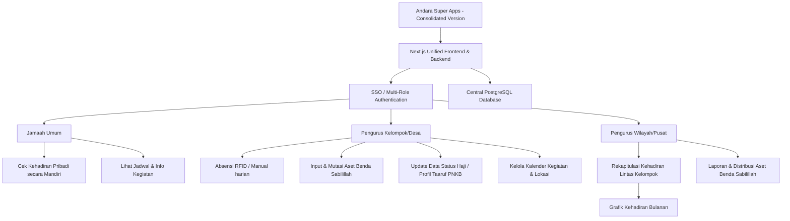

# Laporan Perbandingan Independen: Andara Super Apps vs Ngajiku

Laporan ini menyajikan analisis komparatif menyeluruh antara **Andara Super Apps** dan **Ngajiku** sebagai dua platform manajemen jamaah yang berdiri sendiri (*independent standalone systems*). Analisis ini mencakup konsep dasar, target pengguna, fitur utama, antarmuka (UI/UX), arsitektur teknis, serta kelebihan dan kekurangan masing-masing.

---

## 1. Tabel Perbandingan Komprehensif

| Dimensi | Andara Super Apps | Ngajiku |
| :--- | :--- | :--- |
| **Konsep Utama** | Platform pengelolaan operasional jamaah terpadu multi-fitur (Kehadiran, Aset Benda Sabilillah, Status Haji) dengan dukungan RFID harian. | System pencatatan kehadiran jamaah berbasis web cloud (*cloud-first*) untuk pemantauan kehadiran jarak jauh oleh pengurus pusat. |
| **Fokus Pengguna** | - **Pengurus**: Mengelola kehadiran dan mendata aset organisasi. - **Jamaah Umum**: Login mandiri via HP/Browser untuk memantau kehadiran pribadi secara transparan. | Pengurus wilayah/pusat untuk merekap dan memonitor data kehadiran jamaah dari berbagai kelompok. |
| **Fitur Unggulan** | - Smart Presence dengan Tap RFID fisik. - Penyaringan kehadiran otomatis berdasarkan kategori dinamis (Lansia, Dewasa, Pra Nikah, Remaja). - Pengelolaan inventaris aset fisik (Benda Sabilillah). - Integrasi pelacakan status haji jamaah. - **Layanan Taaruf Tim PNKB** (Pernikahan & Keluarga Bahagia). - Kalender Kegiatan/Agenda Kelompok & Pengelolaan Lokasi. - Manajemen Akun Pengurus (User Management). - Log audit aktivitas admin. | - Dropdown jadwal sambung (Ngaji Klp, Hasda Klp, 5 Unsur, Ibu2, Asad Lk/Pr, dll). - Rekapitulasi absensi bulanan/sesi dalam modal terpadu. - Scan Tap RFID di Lokasi & Penyimpanan data RFID cloud. |
| **UI (User Interface)** | Desain premium, modern, dan responsif (Next.js) dengan visualisasi *badge* status yang jelas dan mode kegelapan (*dark mode*). | Desain minimalis dan fungsional berbasis antarmuka administrasi web standar (*dashboard-style*). |
| **UX (User Experience)** | Sangat cepat (optimasi Vercel region `sin1`), dirancang untuk operasional harian yang membutuhkan respons instan di lokasi. | Dirancang untuk pelaporan berkala pasca-kegiatan (*post-event*), namun memiliki batasan query (seperti pemotongan limit 100 baris). |
| **Tech Stack** | - Frontend & Backend: Next.js (React) - Database: Neon Serverless PostgreSQL - Hosting: Vercel (Singapore Region `sin1`) | - Frontend: React Web App - Database: Supabase (PostgreSQL) - Hosting: Vercel |
| **Penyimpanan Data** | Disimpan secara terpusat di database mandiri milik Andara (Neon PostgreSQL) via browser HP/Laptop/PC. | Disimpan secara terpusat di database cloud milik Ngajiku (Supabase). |

---

## 2. Analisis Keunggulan & Kekurangan

### Andara Super Apps
> [!TIP]
> **Keunggulan (Pros):**
> * **Hardware Integration**: Sangat praktis dengan pemindaian kartu RFID fisik untuk absensi harian jamaah secara instan.
> * **Smart Filtering**: Pembagian kelas presensi otomatis berdasarkan umur, gender, dan status pernikahan jamaah.
> * **Multi-Fitur**: Sangat komprehensif, tidak hanya absensi, tapi juga mengelola pencatatan aset fisik kelompok (Benda Sabilillah), data status haji jamaah, **Layanan Taaruf Tim PNKB**, Kalender Kegiatan, Pengelolaan Lokasi, dan Manajemen Akun Pengurus.
> * **Transparansi Akses**: Memberikan hak akses mandiri bagi jamaah umum untuk memantau rekap absensinya sendiri langsung dari HP.
> * **Performa Maksimal**: Latensi database sangat rendah (<100ms) berkat serverless hosting di Singapura (`sin1`).

> [!WARNING]
> **Kekurangan (Cons):**
> * **Kompleksitas Operasional**: Membutuhkan perangkat keras (RFID reader) untuk performa absensi terbaik di lokasi.
> * **Perawatan Mandiri**: Anda memegang kendali dan perawatan penuh atas infrastruktur hosting dan database sendiri.

### Ngajiku
> [!TIP]
> **Keunggulan (Pros):**
> * **Sederhana & Terfokus**: Antarmuka ringkas yang hanya berfokus pada pelaporan rekap kehadiran jamaah.
> * **Distribusi Cloud Instan**: Akses cloud global yang mempermudah pengurus tingkat wilayah/pusat melihat data rekapitulasi.
> * **Dukungan RFID Lengkap**: Mendukung pemindaian Tap RFID langsung di lokasi dan penyimpanan data RFID di database pusat.

> [!CAUTION]
> **Kekurangan (Cons):**
> * **Keterbatasan Jumlah Data (Bug Limit)**: Query rekap presensi di UI dibatasi oleh limit PostgREST default (100 baris), menyebabkan kelompok besar (>100 jamaah) terpotong dan memunculkan tanda strip (`-`).
> * **Fitur Terbatas**: Hanya fokus pada presensi kehadiran, tidak memiliki manajemen operasional jamaah lainnya (seperti data status haji atau inventaris aset Benda Sabilillah).
> * **Ketergantungan Internet**: Sangat bergantung pada kestabilan koneksi internet untuk setiap transaksi data.

---

## 3. Rancangan Konsolidasi: Menyatukan Kedua Aplikasi Menjadi Satu "Super Apps"

Konsolidasi ini bertujuan untuk menyatukan kekuatan **Ngajiku** (pelaporan lintas kelompok/wilayah) dan **Andara Super Apps** (operasional harian, manajemen aset Benda Sabilillah, status haji, layanan taaruf PNKB, kalender kegiatan, lokasi, dan akses jamaah) ke dalam satu platform tunggal yang holistik.

### A. Arsitektur Konsolidasian (Unified System Design)

### B. Konsep Penggabungan Fitur & Alur Kerja

1. **Dashboard Berbasis Peran (Role-Based Access Control)**:
   * **Dashboard Jamaah**: Akses mandiri untuk jamaah biasa untuk melihat riwayat kehadiran mereka sendiri dan meminjam/memakai aset kelompok.
   * **Dashboard Asisten/Pengurus Kelompok**: Menyediakan input cepat kehadiran (termasuk input tap RFID), manajemen detail jamaah, serta pendataan barang Benda Sabilillah.
   * **Dashboard Wilayah (Ngajiku reporting)**: Menu khusus untuk pengurus tingkat daerah/wilayah untuk menarik laporan statistik kehadiran seluruh kelompok secara real-time tanpa batas (tanpa bug pemotongan 100 baris, karena kueri Next.js dikonfigurasi menggunakan range tak terbatas atau pagination).

2. **Penyatuan Database (Unified Database Schema)**:
   * Menggabungkan schema database. Tabel `presensi` di database terpadu akan langsung mereferensikan tabel `jamaah` dan tabel `kelompok`/`sesi`.
   * Integrasi ini menghilangkan perlunya tombol "Sync" secara manual. Data yang dimasukkan oleh pengurus kelompok di lapangan langsung ter-update di layar monitor pengurus wilayah secara real-time.

3. **Mekanisme Pendaftaran RFID Terpusat**:
   * Pengurus kelompok dapat mendaftarkan kartu RFID baru untuk jamaah langsung dari aplikasi. Kode RFID ini disimpan di profil jamaah database pusat, sehingga bisa digunakan untuk absensi di kelas mana pun secara fleksibel.

4. **Dashboard Inventaris Aset (Benda Sabilillah) Terkonsolidasi**:
   * Aset fisik seperti karpet, sound system, proyektor, atau buku inventaris kelompok didata secara terpusat. Pengurus wilayah dapat melacak distribusi barang-barang milik sabilillah ini lintas kelompok/desa secara transparan untuk memaksimalkan utilitasnya.

---

## 4. Rancangan Modul Baru: ZIS (Zakat, Infaq, Shadaqah) & Qurban Terkonsolidasi

Modul baru ini akan memperluas fungsionalitas Andara Super Apps sebagai platform holistik. Integrasi ini sangat diuntungkan oleh penyatuan data dari **Andara Super Apps** dan **Ngajiku** karena data dasar jamaah yang telah terkonsolidasi menjadi pondasi utamanya.

### A. Modul ZIS (Zakat, Infaq, Shadaqah) Terpadu

Modul ini mempermudah pengurus dalam pencatatan dan penghitungan kewajiban zakat jamaah secara otomatis.

1. **Pengelolaan Status Mustahik & Muzakki**:
   * Pengurus dapat menandai status ekonomi jamaah (Muzakki/Wajib Zakat vs Mustahik/Penerima Zakat) secara dinamis langsung pada database profil jamaah.
2. **Pencatatan Zakat Fitrah & Kalkulator Beras**:
   * Fitur input setoran Zakat Fitrah (baik berupa beras maupun uang tunai senilai harga beras).
   * Rumus perhitungan otomatis berbasis nilai makanan pokok (misal: 2.5 kg atau 3.5 liter beras per jiwa), sehingga pengurus cukup menginput jumlah jiwa dalam keluarga, dan aplikasi akan menampilkan total beras/uang yang harus dibayarkan secara instan.
3. **Pencatatan & Kalkulator Zakat Maal**:
   * Kalkulator interaktif bagi jamaah untuk menghitung zakat harta mereka sendiri (Zakat Maal tabungan, emas, perdagangan, maupun pertanian) melalui akun mandiri jamaah.
   * **Ijtihad Nilai Nisab**: Dashboard admin untuk memperbarui nilai nisab dinamis (berdasarkan harga emas/perak terkini hasil ijtihad bersama) sebagai batas minimal kewajiban zakat maal. Jamaah akan mendapatkan notifikasi otomatis di dashboard jika nilai aset tabungan mereka telah melewati batas nisab.

### B. Modul Qurban (Tabungan & Distribusi)

Mengotomatisasi pencatatan program qurban tahunan kelompok.

1. **Tabungan Qurban Jamaah**:
   * Pencatatan cicilan/tabungan qurban jamaah secara berkala sepanjang tahun. Jamaah dapat memantau akumulasi tabungan qurban mereka secara mandiri melalui HP masing-masing.
2. **Pengelolaan Hewan Qurban**:
   * Pendataan jenis hewan (sapi/kambing), harga beli, status kepemilikan kelompok (misal: patungan 7 orang untuk sapi), serta status kesehatan hewan.

### C. Sinergi Fitur Konsolidasi (Andara + Ngajiku)

Penyatuan database dan fitur Andara + Ngajiku memberikan keuntungan operasional yang luar biasa:

1. **Verifikasi Penerimaan Paket dengan RFID (Anti-Double)**:
   * Saat pembagian zakat fitrah atau daging qurban di lokasi, pengurus cukup **men-tap kartu RFID mustahik** (fitur Andara). Sistem akan memverifikasi identitas mereka dan mencatat status "Sudah Menerima".
   * Jika mustahik tersebut mencoba mengantre kembali, sistem akan berbunyi dan menolak tap berikutnya. Ini menjamin distribusi qurban dan zakat 100% adil dan tepat sasaran.
2. **Pelaporan Konsolidasi Wilayah (Ngajiku reporting)**:
   * Total pengumpulan zakat fitrah, zakat maal, infaq, dan jumlah hewan qurban dari seluruh kelompok di bawah naungan desa/daerah akan langsung terkapitulasi secara otomatis di dashboard wilayah/pusat (fitur Ngajiku).
   * Pengurus wilayah dapat melihat peta sebaran mustahik dan muzakki secara real-time untuk penyeimbangan distribusi bantuan sosial agar lebih merata.
